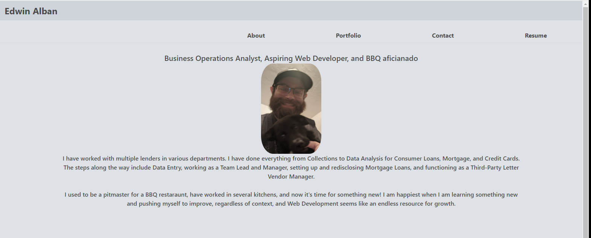

# React-Portfolio
A portfolio of my work made with React Components

Creates a portfolio for housing projects and showcasing deployed apps.

## Description

I built this project in order to practice using React components to build a front end for a portfolio. I learned about React components, mapping properties of objects, and how to build a single-page, front end application that does not require reloading.

This single-page application solves multiple problems. Page load speed is faster due to asynchronous communication, which improves overall user experience and reduces the server load when compared with a multi-page application. The page will not require a full reload, but will instead loan once and only update contect that has changed with subsequent interactions. The application will also perform well with various devices as it is responsive and adaptive.

## Table of Contents

- [Technologies Used](#installation)
- [Usage](#usage)
- [Tests](#tests)

## Technologies Used

* React
* Bulma (CSS Framework)
* Javascript
* HTML
* CSS

## Usage

In order to use/view the application, click the link below.

https://edwinalban.github.io/React-Portfolio/

## Tests

This project can be tested by clicking the link above and navigating to different sections of the portfolio by clicking the links in the navbar. Each project on the Portfolio can be clicked to view the deployed application and each project's repo can be seen by clicking the GitHub logo icon in the upper-right corner. My resume can be downloaded from the Resume section by clicking the download link.
